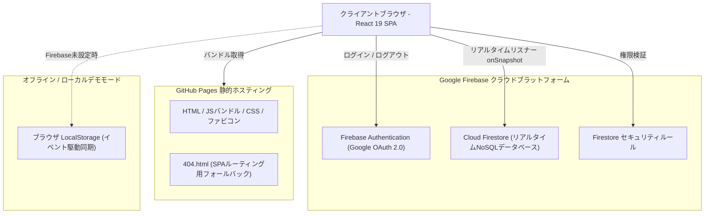
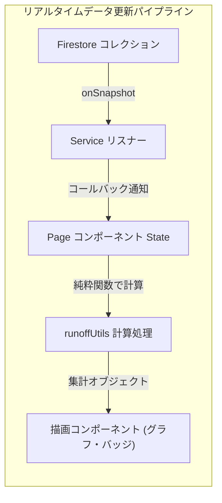

# Votica - アーキテクチャ・技術仕様書

本ドキュメントは、決選投票対応 汎用投票プラットフォーム **Votica** のシステムアーキテクチャ、コンポーネント構成、状態管理、コアアルゴリズム、セキュリティ設計、およびCI/CDデプロイパイプラインに関する詳細な技術仕様書です。

---

## 1. システム概要と基本設計思想

Votica は、選択肢が多い意思決定やアンケートで同率1位が発生した際に、スマートに上位・同率候補による「決選投票」を開催できるWebアプリケーションです。**GitHub Pages（静的ホスティング）** と **Firebase（Google Cloud Firestore + Authentication）** による完全サーバーレスな **Single-Page Application (SPA)** として構成されています。



### 設計の基本方針:
1. **サーバー運用保守ゼロ**: クラウドBaaSを活用したクライアント完結のSPAアーキテクチャ。サーバー構築やOSパッチ当て等の運用コストが一切かかりません。
2. **リアルタイム協調動作**: Firestore の `onSnapshot` リスナーにより、誰かが投票した瞬間に全員の画面でグラフや順位がミリ秒単位で同期します。
3. **分散型の投票作成権限**: Googleログインを行ったすべてのユーザーが自由に投票フォームを作成し、独自の管理者として投票を管理・決選投票の実施が可能です。
4. **1人1票の厳格な冪等性**: 投票者のUIDをドキュメントIDとして使用することで、データベースレベルで重複投票を防止し、投票内容の変更にも安全に対応します。
5. **ゼロ設定で即時体験（ローカルデモモード）**: Firebase接続情報がない場合でも、ブラウザの `localStorage` とカスタムイベントにより全機能がローカルで即座に動作します。
6. **プライバシーとURL限定公開**: 投票はデフォルトでURL限定（非公開）です。リンクやIDを知らない第三者には他者の投票が一覧表示されません。

---

## 2. 技術スタックと採用ライブラリ

| 分類 | 技術 / ライブラリ | バージョン | 採用理由・用途 |
| :--- | :--- | :--- | :--- |
| **UIフレームワーク** | React / React DOM | 19.x | 最新のコンポーネント設計、フック、高速なレンダリング。 |
| **開発言語** | TypeScript | 5.8+ | 厳格な静的型検査と安全なデータモデル定義。 |
| **ビルドツール** | Vite / Rolldown | 8.2+ | 高速なHMR（Hot Module Replacement）と最適化された本番バンドル。 |
| **ルーティング** | React Router DOM | 7.x | GitHub Pagesと完全互換なハッシュベースルーティング（`HashRouter`）。 |
| **スタイリング** | Tailwind CSS | 4.x | モダンで洗練されたユーティリティファーストCSS。 |
| **アイコン** | Lucide React | 最新 | 視認性とアクセシビリティの高いSVGアイコン。 |
| **データベース/認証** | Firebase SDK | 11.x | Google OAuth認証およびCloud Firestoreリアルタイムリスナー。 |
| **演出・エフェクト** | Canvas Confetti | 最新 | 投票完了時の華やかな紙吹雪アニメーション演出。 |
| **QRコード生成** | qrcode.react | 最新 | スマートフォン等で即座にURLを共有できるQRコード描画。 |
| **テストフレームワーク** | Vitest | 4.x | 高速なユニットテスト・結合テスト実行環境。 |

---

## 3. フロントエンド構成 & ディレクトリ構造

```
src/
├── components/
│   ├── common/              # 共通汎用UIコンポーネント
│   │   ├── Button.tsx       # バリアント対応ボタン（primary, danger, outline...）
│   │   ├── Modal.tsx        # モーダルダイアログ（Escapeキー/背景クリック対応）
│   │   ├── FirebaseConfigModal.tsx # Firebase接続設定モーダル
│   │   └── OssLicensesModal.tsx    # OSSライセンス表記モーダル
│   ├── layout/              # レイアウト・枠組みコンポーネント
│   │   ├── Header.tsx       # ヘッダー（ロゴ、言語切替、ログイン状態、Firebaseステータス）
│   │   └── Footer.tsx       # フッター（コピーライト、OSSライセンスリンク）
│   ├── poll/                # 投票作成・投票フォーム用コンポーネント
│   │   ├── OptionInputList.tsx    # 選択肢の追加・削除・並び替えUI
│   │   ├── VoteOptionCard.tsx     # 選択肢カード（単一/複数選択）
│   │   ├── CountdownTimer.tsx     # 締切カウントダウンタイマー
│   │   ├── ShareModal.tsx         # 共有リンク・QRコードモーダル
│   │   ├── RunoffWizardModal.tsx  # 決選投票作成ウィザード
│   │   ├── DeletePollModal.tsx    # 投票削除確認モーダル
│   │   └── PollCard.tsx           # ダッシュボード用投票カード
│   └── results/             # 結果集計・可視化コンポーネント
│       ├── ResultBarChart.tsx     # アニメーション付き得票率バーグラフ・投票者一覧
│       ├── WinnerBadge.tsx        # 1位確定または同率1位検出のアラートバナー
│       └── RoundSelector.tsx      # ラウンド切替セレクター
├── contexts/
│   ├── AuthContext.tsx      # Google認証状態・デモユーザー管理
│   ├── LanguageContext.tsx  # 多言語切替・翻訳フック
│   └── ToastContext.tsx     # 通知トースト管理（成功/エラー/警告）
├── lib/
│   ├── firebase.ts          # Firebase初期化および設定管理
│   ├── firestoreService.ts  # Firestore CRUD・リアルタイムリスナー・アクセス履歴
│   ├── runoffUtils.ts       # 決選投票候補抽出、順位計算、同率判定アルゴリズム
│   ├── types.ts             # 全データモデルのTypeScript型定義
│   └── i18n/
│       └── translations.ts  # 日英翻訳辞書（型安全）
└── pages/
    ├── HomePage.tsx         # トップページ（作成した投票・参加した投票一覧、直接ID参加）
    ├── CreatePollPage.tsx   # 新規投票作成ページ
    ├── PollVotingPage.tsx   # 投票ページ（カウントダウン・複数ラウンド対応）
    ├── PollResultsPage.tsx  # 集計結果・管理者コントロールパネル
    └── NotFoundPage.tsx     # 404エラーページ
```

---

## 4. 状態管理 & リアルタイム同期アーキテクチャ

Votica では、過度なグローバル状態管理ライブラリ（Redux等）を避け、**イベント駆動型サブスクリプション** と **React Context** を組み合わせています。



### Context プロバイダーの責務:
1. **`AuthContext`**: `currentUser` の保持、`signInWithGoogle()`、`signInAsDemoUser()`、`logout()` を提供。
2. **`LanguageContext`**: `t(key, params)` 翻訳関数、現在の `language`（`'ja'` \| `'en'`）、`toggleLanguage()` を提供。
3. **`ToastContext`**: `showToast(type, message)` による一時メッセージ表示を管理。

---

## 5. コアアルゴリズムとビジネスロジック

### 5.1 標準競技順位（Standard Competition Ranking）の算出 (`runoffUtils.ts`)
同率得票が発生した場合に公平な順位付けを行うため、Votica は「1位, 1位, 3位...」という**標準競技順位方式**を採用しています。

```typescript
// 得票数の降順でソート
unrankedList.sort((a, b) => b.votesCount - a.votesCount);

let currentRank = 1;
for (let i = 0; i < unrankedList.length; i++) {
  // 前の選択肢より得票数が少ない場合のみ、現在のインデックス+1に順位を更新
  if (i > 0 && unrankedList[i].votesCount < unrankedList[i - 1].votesCount) {
    currentRank = i + 1;
  }
  results.push({ ...unrankedList[i], rank: currentRank });
}
```

### 5.2 同率1位（Tie for 1st Place）の自動検出
以下の条件をすべて満たした場合に「同率1位」と判定されます:
$$\text{順位が 1位の選択肢数} \ge 2 \quad \text{かつ} \quad \text{最多得票数} > 0$$
この条件を満たすと:
- `summary.hasTieForFirst` が `true` になります。
- 結果画面および投票画面に「同率1位検出」のアラートバナーが表示されます。
- 管理者に対して「決選投票を開始」ボタンが表示され、1クリックでウィザードを開けます。

### 5.3 決選投票の候補抽出モード
決選投票ラウンド（第2回以降）を作成する際、管理者は以下の3つの抽出方式を選択できます:
1. **`tie_breaker`（同率1位のみ・推奨）**: 前回の投票で同率1位となった候補のみを自動抽出。
2. **`top_k`（上位K件）**: 前回の順位に基づき、上位 $K$ 件（$K \ge 2$）の候補を自動抽出。
3. **`manual`（カスタム手動選択）**: 前回の全候補から、管理者がチェックボックスで任意の候補を選択。

---

## 6. 多言語対応 (i18n) エンジン仕様

外部ライブラリに依存しない、軽量で型安全な多言語エンジンを実装しています。

- **ブラウザ言語の自動検出**: `navigator.languages` を検査し、日本語（`ja` / `ja-JP`）が含まれていればデフォルトを `'ja'`、それ以外はすべて `'en'` に設定。
- **ユーザー設定の永続化**: ヘッダーの言語切替ボタンを押すと、`localStorage.getItem('votica_lang')` に保存され次回アクセス時も維持。
- **パラメータ置換機能**:
  ```typescript
  export function interpolate(text: string, params?: Record<string, string | number>): string {
    if (!params) return text;
    return text.replace(/\{\{(\w+)\}\}/g, (_, key) => {
      return params[key] !== undefined ? String(params[key]) : `{{${key}}}`;
    });
  }
  ```

---

## 7. セキュリティ・プライバシー設計

1. **アトミックな1人1票保証**: `/polls/{id}/rounds/{roundNumber}/votes/{userId}` に書き込む際、ユーザーUIDをドキュメントIDとするため、再投票時はドキュメントが上書き更新され、重複登録（多重投票）が構造上不可能です。
2. **Google OAuth 認証**: 投票フォームの作成権限および厳格な本人確認投票を保証します。
3. **URL限定公開（Unlisted）設計**: 全体の投票一覧を公開スキャンさせず、URLまたはIDを知ってアクセスした投票のみがローカルアクセス履歴（`votica_accessed_poll_ids`）に記録・一覧表示されます。
4. **管理者権限の保護**: 投票の削除、結果公開設定、早期終了、決選投票の作成は、FirestoreセキュリティルールおよびUI側で `creatorUid` との一致を厳格に検証します。
5. **匿名投票モード**: デフォルト（`showVoterNames: false`）では、誰がどの選択肢に投票したかの個人内訳は非公開となり、得票数と割合のみが表示されます。

---

## 8. ビルド & CI/CD デプロイ仕様

### GitHub Pages SPA ルーティング対応
GitHub Pages は静的ホスティングであるため、以下の工夫を行っています:
1. **ハッシュルーティング（`HashRouter`）**: URL形式を `https://<domain>/#/poll/<id>` とすることで、サーバーへの不要なリクエストを防ぎ、クライアント完結で画面遷移します。
2. **`public/404.html` リダイレクター**: 直リンク等で非ハッシュURLに直接アクセスされた場合、`404.html` がハッシュ付きURLへ自動変換してリダイレクトします。

### GitHub Actions 自動デプロイパイプライン (`.github/workflows/deploy.yml`):
1. **トリガー**: `main` ブランチへのコードプッシュ時に自動起動。
2. **環境変数注入**: GitHub Repository Secrets から Firebase 接続キー（`VITE_FIREBASE_API_KEY` 等）を取得してビルド時に埋め込み。
3. **ビルド検証**: `tsc` による型検査、および `vite build` によるバンドル最適化を実行。
4. **デプロイ**: 生成された `dist/` ディレクトリを GitHub Pages 環境へ自動公開。
