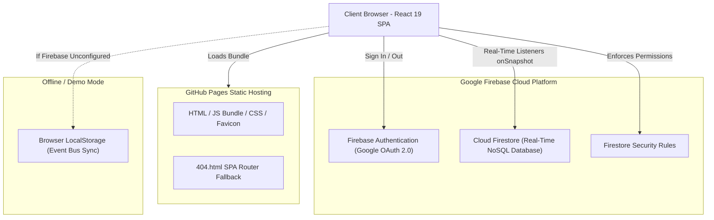
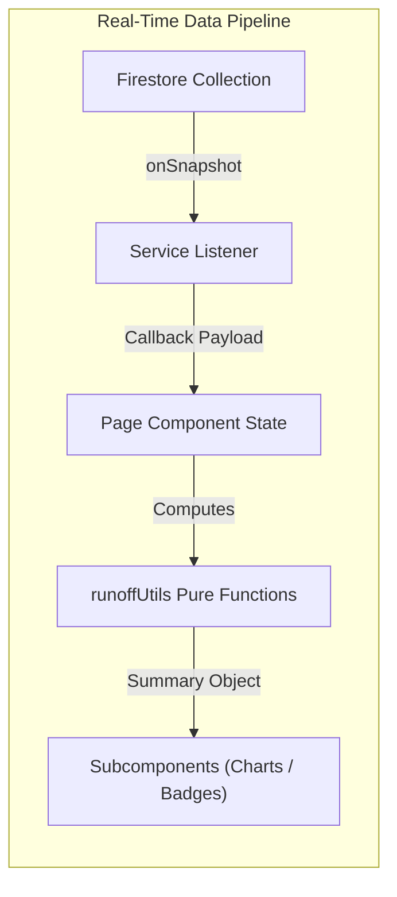

# Votica - Architecture & Technical Specification

This document provides a comprehensive technical overview of **Votica**, covering the system architecture, component hierarchies, state management, algorithmic logic, security model, and deployment pipelines.

---

## 1. System Overview & Architecture Principles

Votica is a decentralized, general-purpose voting and multi-round runoff decision-making platform. It is engineered as a **Serverless Static Single-Page Application (SPA)** deployed on **GitHub Pages** with **Firebase (Google Cloud Firestore + Authentication)** as its backend-as-a-service.



### Core Design Principles:
1. **Zero Server Maintenance**: Pure client-side SPA with cloud database hooks. No custom application servers or containers to maintain.
2. **Instant Real-Time Collaboration**: Sub-second live tally updates powered by Firestore `onSnapshot` real-time listeners.
3. **Decentralized Democratic Ownership**: Any signed-in Google user can create and manage their own polls with granular administrative controls.
4. **Idempotent 1-Person-1-Vote**: Uses the voter's Unique Identifier as the Firestore Document ID, ensuring ballot deduplication at the database level.
5. **Zero-Configuration Fallback (Local Demo Mode)**: Runs seamlessly offline or in demonstration environments via structured `localStorage` with reactive event dispatching.
6. **URL Privacy & Unlisted Discovery**: Polls are unlisted by default. Third parties cannot browse or scrape polls without receiving the link or ID.

---

## 2. Technology Stack & Dependencies

| Category | Technology / Library | Version | Purpose |
| :--- | :--- | :--- | :--- |
| **UI Framework** | React / React DOM | 19.x | Component lifecycle, hooks, and UI rendering. |
| **Language** | TypeScript | 5.8+ | Strict type safety and end-to-end interface contracts. |
| **Build Tool & Bundler** | Vite / Rolldown | 8.2+ | Blazing-fast development server and optimized production build. |
| **Routing** | React Router DOM | 7.x | Hash-based client-side routing for GitHub Pages (`HashRouter`). |
| **Styling & Design** | Tailwind CSS | 4.x | Modern, responsive utility-first styling with dark/light contrasts. |
| **Icons** | Lucide React | Latest | Crisp, accessible SVG vector icons. |
| **Backend & Database** | Firebase SDK | 11.x | Authentication (Google OAuth) and Cloud Firestore NoSQL database. |
| **Visual Effects** | Canvas Confetti | Latest | Celebration particle animations upon successful vote casting. |
| **QR Code Generator** | qrcode.react | Latest | Instant QR code rendering for mobile device sharing. |
| **Testing** | Vitest | 4.x | Fast unit and integration test runner. |

---

## 3. Frontend Architecture & Component Hierarchy

```
src/
├── components/
│   ├── common/              # Universal reusable UI primitives
│   │   ├── Button.tsx       # Standardized button with variants (primary, danger, outline...)
│   │   ├── Modal.tsx        # Accessible backdrop modal dialog with Escape/outside click
│   │   ├── FirebaseConfigModal.tsx # Runtime Firebase credentials configuration dialog
│   │   └── OssLicensesModal.tsx    # Open Source Software (OSS) license credits
│   ├── layout/              # Structural chrome components
│   │   ├── Header.tsx       # Logo, language toggle, Google Auth state, Firebase status pill
│   │   └── Footer.tsx       # Copyright, tagline, OSS license modal trigger
│   ├── poll/                # Poll creation and ballot casting components
│   │   ├── OptionInputList.tsx    # Dynamic option manager (add, delete, reorder up/down)
│   │   ├── VoteOptionCard.tsx     # Interactive option selector with selection state
│   │   ├── CountdownTimer.tsx     # Live deadline countdown with status badges
│   │   ├── ShareModal.tsx         # QR Code, URL copy, and social sharing links
│   │   ├── RunoffWizardModal.tsx  # Wizard for launching Round 2+ runoff elections
│   │   ├── DeletePollModal.tsx    # Safety confirmation dialog for poll deletion
│   │   └── PollCard.tsx           # Dashboard card displaying poll status and admin actions
│   └── results/             # Data visualization and tallying components
│       ├── ResultBarChart.tsx     # Animated percentage bars with voter name popovers
│       ├── WinnerBadge.tsx        # Celebratory 1st place or tie detection alert banner
│       └── RoundSelector.tsx      # Multi-round selector tabs for progressive elections
├── contexts/
│   ├── AuthContext.tsx      # Google Auth state, Demo User login, credentials management
│   ├── LanguageContext.tsx  # Multi-language dictionary and runtime language switching
│   └── ToastContext.tsx     # Notification toasts (success, error, warning, info)
├── lib/
│   ├── firebase.ts          # Firebase SDK initialization & localStorage config resolver
│   ├── firestoreService.ts  # Database CRUD, real-time listeners, and access history
│   ├── runoffUtils.ts       # Ranking algorithms, tie detection, and runoff extractors
│   ├── types.ts             # TypeScript interfaces and data models
│   └── i18n/
│       └── translations.ts  # Type-safe translations dictionary (JA / EN)
└── pages/
    ├── HomePage.tsx         # Dashboard for created & accessed polls, direct ID join
    ├── CreatePollPage.tsx   # Poll creation form with option limits and privacy settings
    ├── PollVotingPage.tsx   # Ballot submission page with live countdown & multi-round support
    ├── PollResultsPage.tsx  # Real-time tally charts, admin controls, and runoff launcher
    └── NotFoundPage.tsx     # 404 error page
```

---

## 4. State Management & Real-Time Sync Architecture

Votica avoids complex global state stores in favor of **Event-Driven Subscriptions** and **React Context**:



### Context Providers:
1. **`AuthContext`**: Manages `currentUser`, `signInWithGoogle()`, `signInAsDemoUser()`, and `logout()`.
2. **`LanguageContext`**: Exposes `t(key, params)` helper, active `language` (`'ja'` | `'en'`), and `toggleLanguage()`.
3. **`ToastContext`**: Exposes `showToast(type, message)` with automatic 4-second dismiss timers.

---

## 5. Core Algorithmic Logic & Business Rules

### 5.1 Standard Competition Ranking Algorithm (`runoffUtils.ts`)
To resolve rankings fairly with tied vote counts, Votica implements **Standard Competition Ranking ("1224" ranking)**:

```typescript
// Sort descending by votes count
unrankedList.sort((a, b) => b.votesCount - a.votesCount);

let currentRank = 1;
for (let i = 0; i < unrankedList.length; i++) {
  // If vote count is less than previous item, advance rank to current 1-based index
  if (i > 0 && unrankedList[i].votesCount < unrankedList[i - 1].votesCount) {
    currentRank = i + 1;
  }
  results.push({ ...unrankedList[i], rank: currentRank });
}
```

### 5.2 Tie Detection for 1st Place
A tie for 1st place is detected when:
$$\text{Count}(\text{rank} == 1) \ge 2 \quad \text{and} \quad \text{maxVotes} > 0$$
When this condition is met:
- `summary.hasTieForFirst` becomes `true`.
- The system renders the Tie Alert Banner (`WinnerBadge`).
- The Administrator is prompted with the "Start Runoff Round" button.

### 5.3 Runoff Candidate Extraction Modes
When creating a Runoff Round (Round 2+), the administrator can select one of three candidate filtering algorithms:
1. **`tie_breaker` (Recommended)**: Automatically extracts only the candidate options that tied for 1st place (`tiedFirstOptions`).
2. **`top_k`**: Extracts the top $K$ candidates ($K \ge 2$) based on rank order.
3. **`manual`**: Allows the administrator to manually check and uncheck any combination of candidates from previous rounds.

---

## 6. Internationalization (i18n) Engine

Votica features a zero-dependency, type-safe translation engine:

- **Automatic Browser Detection**: Checks `navigator.languages`. If Japanese (`ja` / `ja-JP`) is present, defaults to `'ja'`; otherwise defaults to `'en'`.
- **User Override Persistence**: Stored in `localStorage.getItem('votica_lang')`.
- **Parameter Interpolation**: Uses regular expression replacement for template strings:
  ```typescript
  export function interpolate(text: string, params?: Record<string, string | number>): string {
    if (!params) return text;
    return text.replace(/\{\{(\w+)\}\}/g, (_, key) => {
      return params[key] !== undefined ? String(params[key]) : `{{${key}}}`;
    });
  }
  ```

---

## 7. Security, Privacy & Data Protection Model

1. **Atomic 1-Person-1-Vote**: Writing to `/polls/{id}/rounds/{roundNumber}/votes/{userId}` uses the voter's authenticated UID as the document key. Submitting a new ballot overwrites the previous ballot rather than appending, preventing ballot-box stuffing.
2. **Google Sign-In Authentication**: Requires OAuth verification for poll creation and strict voting.
3. **Unlisted URL Discovery**: Prevents public listing of polls to uninvited visitors. Only client browsers that have accessed the specific poll URL or ID record it in their local history (`votica_accessed_poll_ids`).
4. **Administrative Authorization**: Modifying poll visibility, ending rounds early, creating runoff rounds, and deleting polls are restricted to the verified `creatorUid` both in UI logic and Firestore Security Rules.
5. **Anonymous Ballot Mode**: When `showVoterNames: false` (default), individual user IDs are not rendered beside voting bars on the public results chart.

---

## 8. Build, CI/CD & Deployment Architecture

### GitHub Pages Routing Solution
GitHub Pages natively hosts static files and serves `404.html` on undefined routes. Votica leverages:
1. **Hash-based Routing (`HashRouter`)**: URLs follow `https://<domain>/#/poll/<id>`, ensuring all route changes are handled client-side without server roundtrips.
2. **`public/404.html` SPA Redirector**: If a direct non-hash URL is requested, `404.html` converts the path into a hash fragment and redirects to `index.html`.

### Automated GitHub Actions Workflow (`.github/workflows/deploy.yml`):
1. **Checkout & Node Setup**: Node.js 20 on Ubuntu runner.
2. **Environment Variable Injection**: Extracts repository Secrets (`VITE_FIREBASE_API_KEY`, etc.) and injects them during `vite build`.
3. **Production Build**: Executes `tsc` and `vite build` into `dist/`.
4. **Artifact Upload & Deployment**: Deploys the static bundle directly to the `github-pages` environment.
