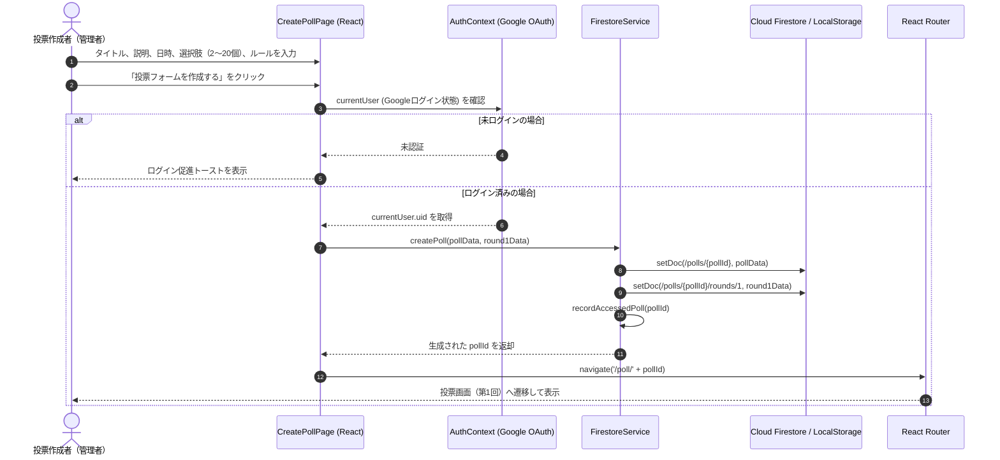
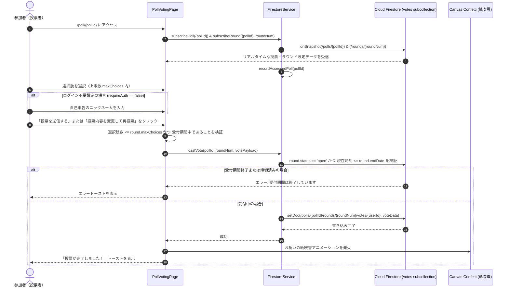
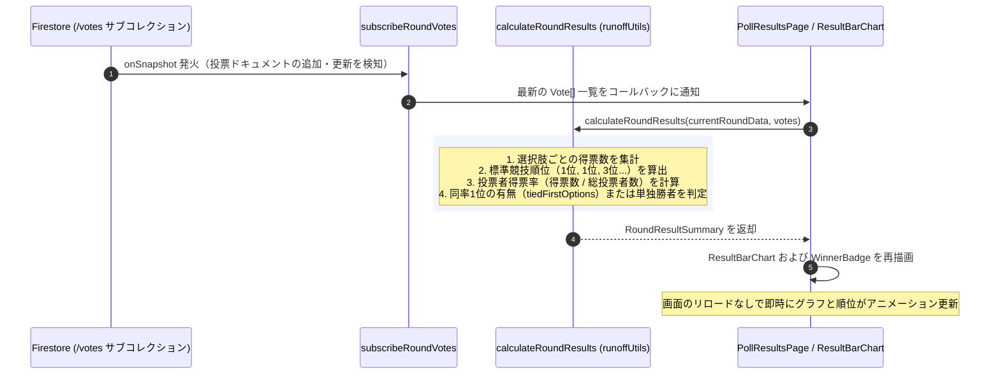
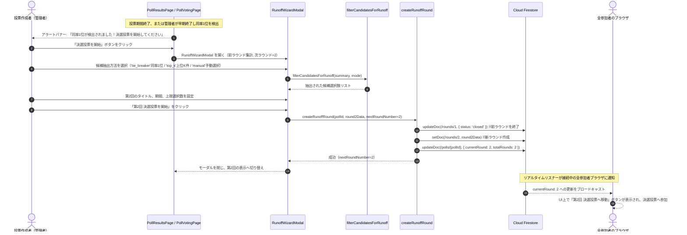
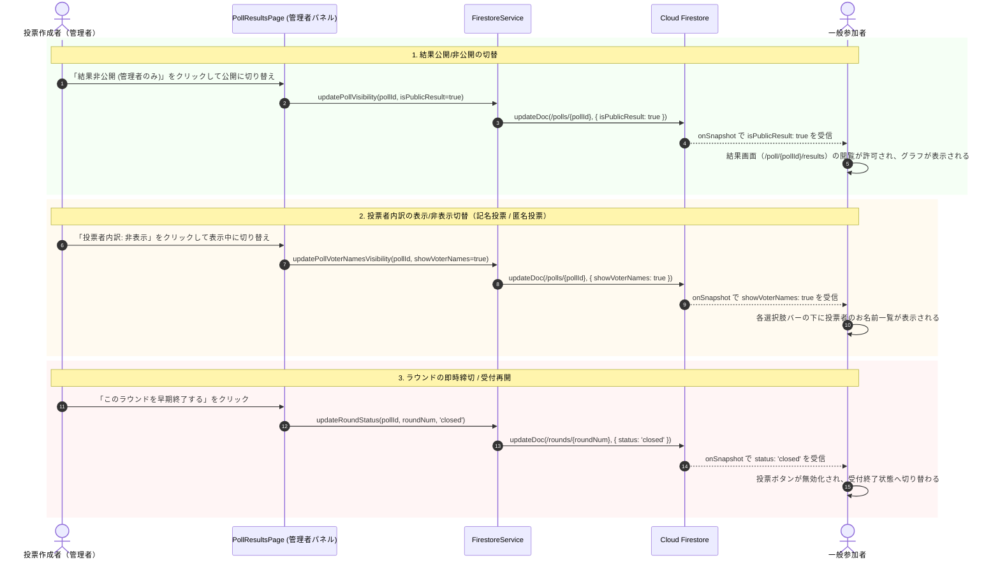
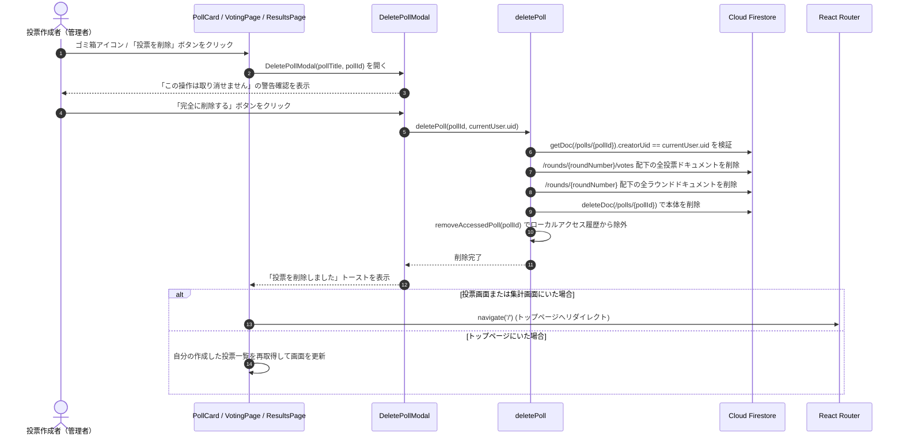
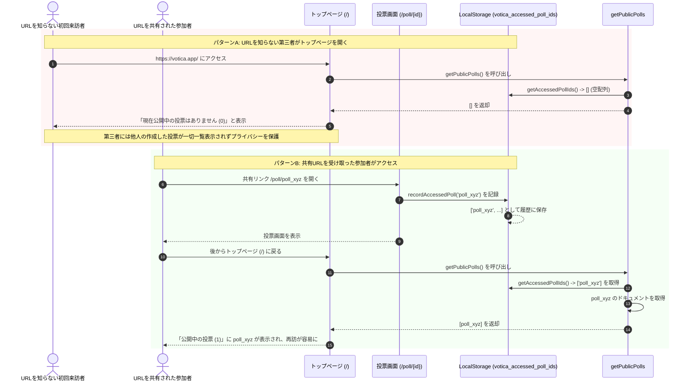

# Votica - シーケンス図・フロー図仕様書

本ドキュメントは、**Votica** における主要なユースケースのシーケンス図および処理フロー図をまとめた仕様書です。

---

## 1. 投票フォーム新規作成フロー

Googleログイン済みの管理者が、初期ラウンド（第1回投票）を含む新しい投票フォームを作成するシーケンスです。

---

## 2. 投票受付・1人1票保証フロー

参加者（Google認証ユーザー、またはニックネーム投票ユーザー）が投票または再投票を行うシーケンスです。

---

## 3. リアルタイム集計 & ライブチャート更新フロー

Firestore のリアルタイムリスナーにより、投票が送信された瞬間に全員の画面で得票グラフとランキングが自動再計算・更新されるシーケンスです。

---

## 4. 決選投票ラウンド作成フロー（同率1位・上位K件）

投票期間終了時に同率1位や上位候補による決選投票ラウンド（第2回、第3回...）を開始するシーケンスです。

---

## 5. 管理者権限・結果公開設定コントロールフロー

管理画面における「結果公開/非公開切替」「投票者内訳（記名/匿名）切替」「ラウンド早期終了/再開」のシーケンスです。

---

## 6. 投票削除フロー

作成者（管理者）が不要になった投票を完全に削除し、安全に関連サブコレクションおよびローカルキャッシュを破棄するシーケンスです。

---

## 7. URL限定公開 & アクセス履歴制御フロー

第三者にURLを知られていない投票がトップページに漏洩しないよう、URLアクセス履歴に基づき表示を制御するシーケンスです。

