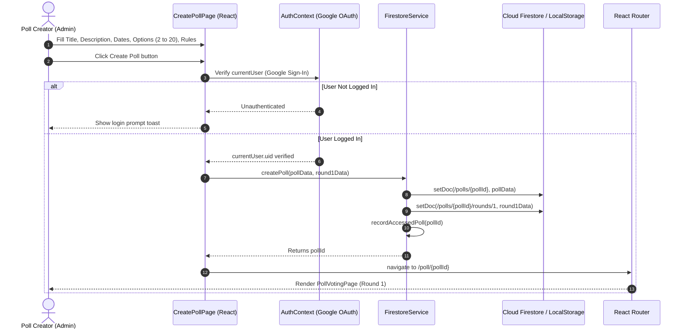
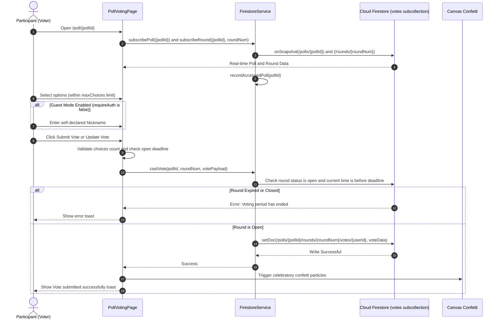
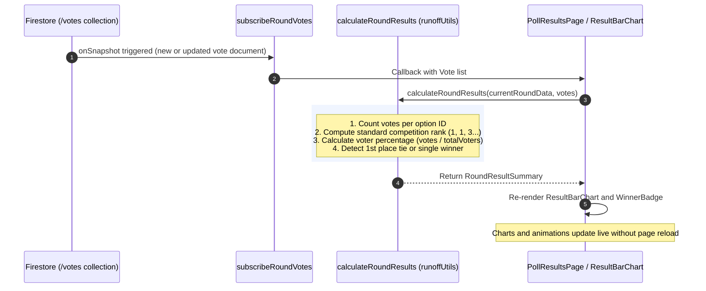
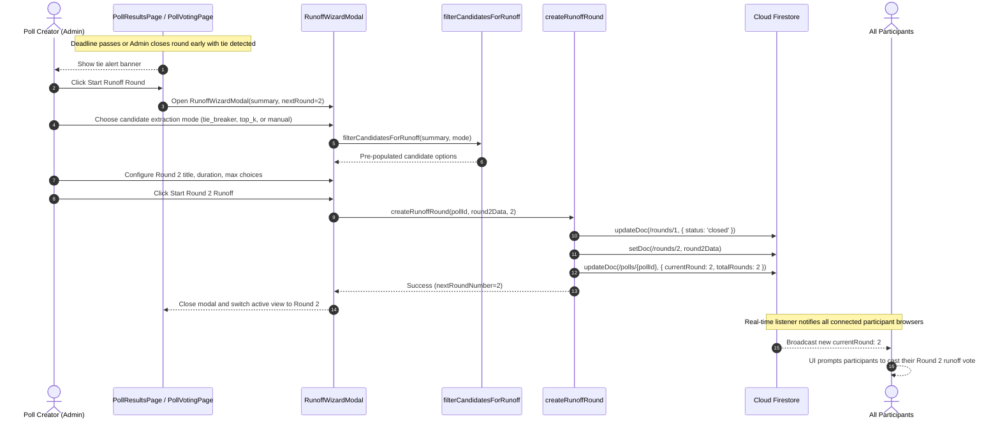
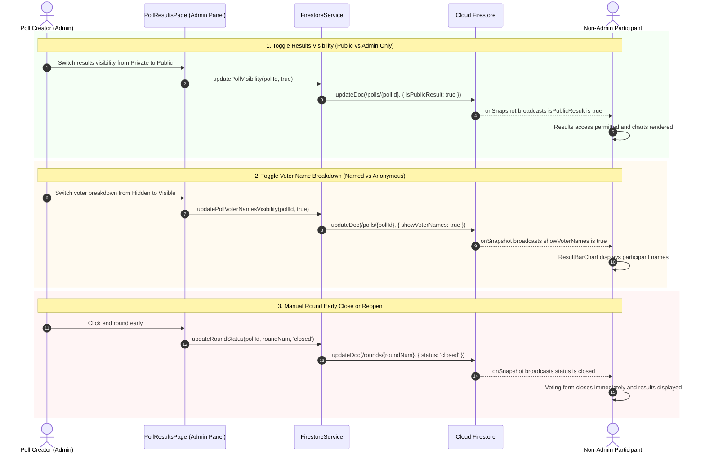
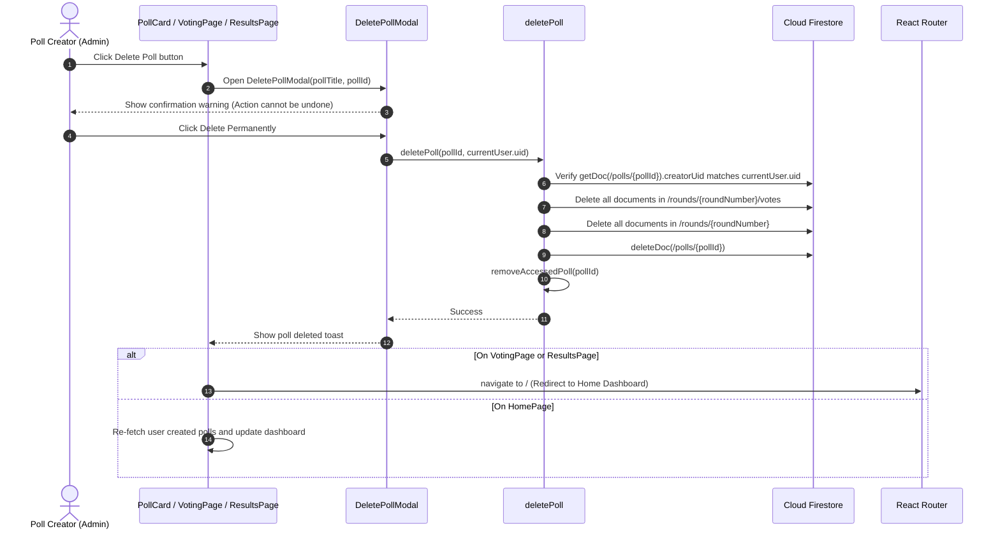
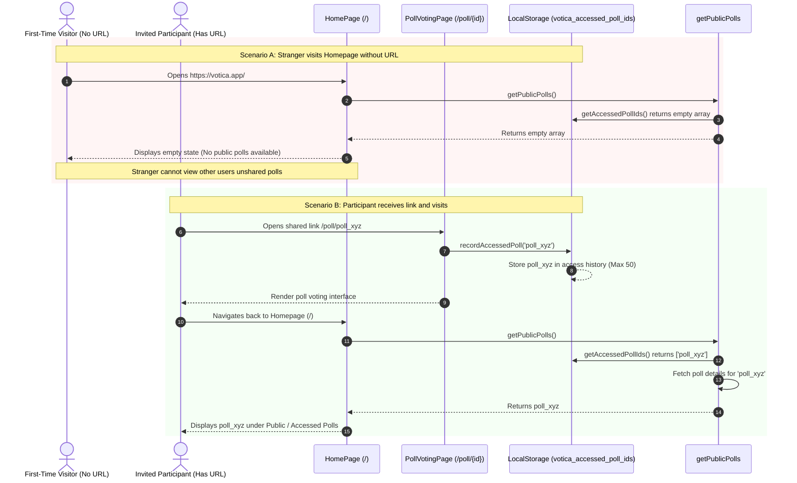

# Votica - Sequence & Flow Diagrams

This document illustrates the sequence diagrams and architectural flowcharts for key workflows in **Votica**.

---

## 1. Poll Creation Flow

Demonstrates an authenticated administrator creating a new multi-option poll with an initial round (Round 1).

---

## 2. Voting Flow (Ballot Casting & One-Vote Enforcement)

Illustrates a participant (Google-authenticated or Guest Nickname) submitting or updating their ballot.

---

## 3. Real-Time Result Tallying & Live Chart Updates

Shows how real-time database listeners update vote counts, percentages, and rankings automatically as votes are cast.

---

## 4. Runoff Round Creation Flow (Tie Break & Top-K)

Illustrates the administrator initiating a Runoff Round when a tie or top-candidate runoff is needed.

---

## 5. Poll & Results Visibility Management Flow

Demonstrates admin configuration controls: Public/Private results toggle, Voter name breakdown toggle, and Round status override.

---

## 6. Poll Deletion Flow

Shows the creator deleting their poll, including subcollections, and clearing local access caches.

---

## 7. URL Discovery & Direct Access Flow

Illustrates how Votica enforces unlisted, URL-only discovery. Polls only appear in a visitor's history if they have accessed the URL or entered the ID.

