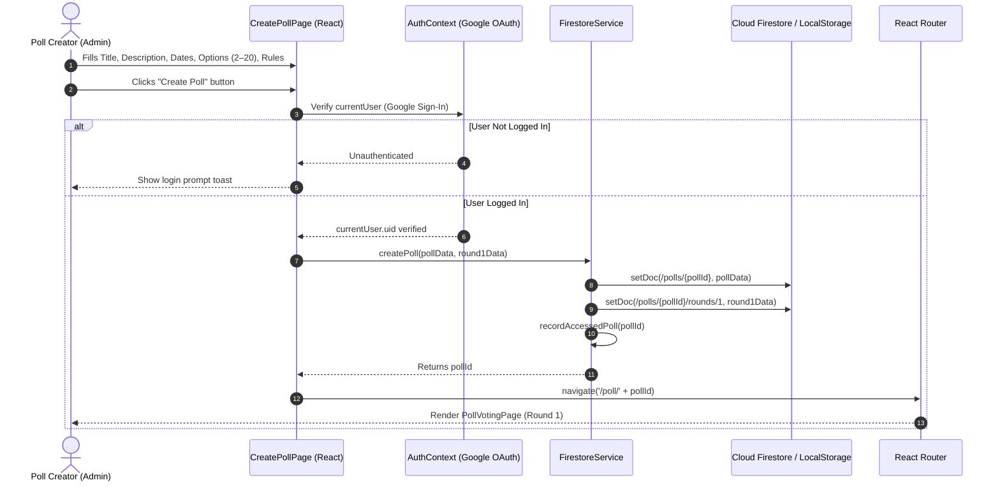
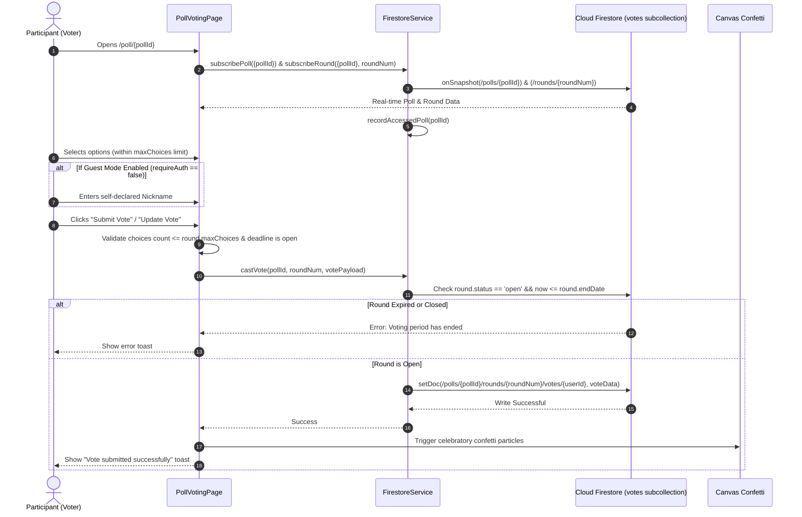
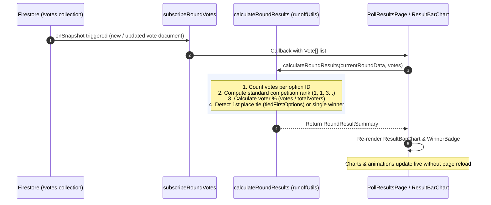
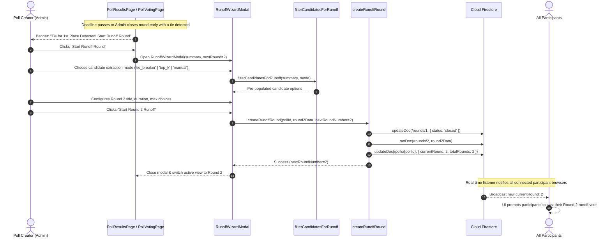
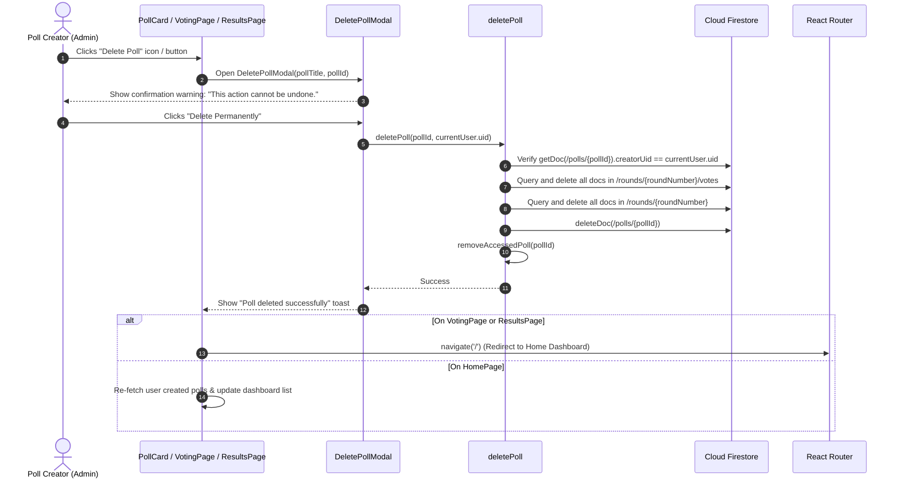
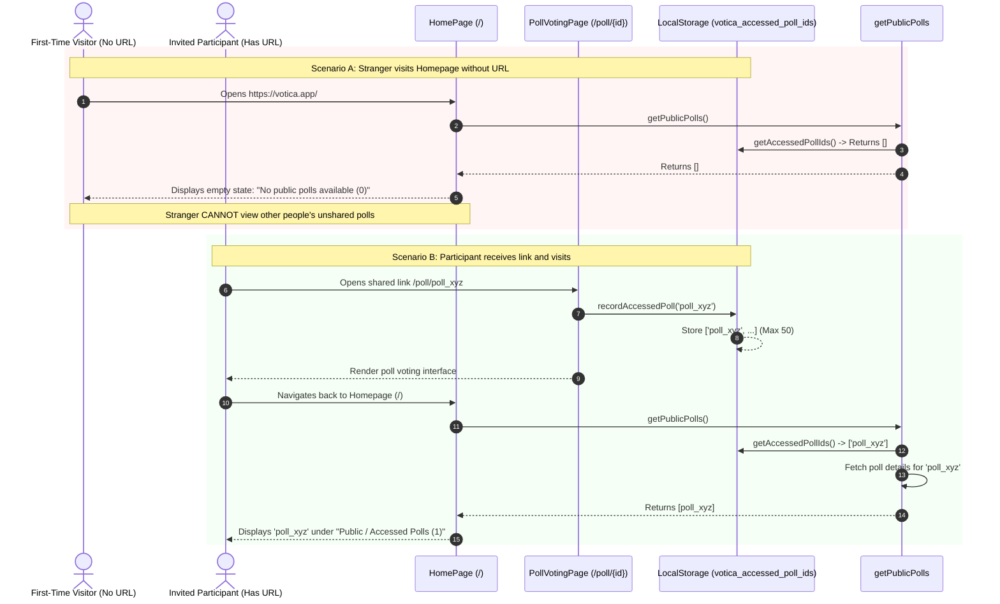

# Votica - Sequence & Flow Diagrams

This document illustrates the sequence diagrams and architectural flowcharts for key workflows in **Votica**.

---

## 1. Poll Creation Flow

Demonstrates an authenticated administrator creating a new multi-option poll with an initial round (Round 1).



---

## 2. Voting Flow (Ballot Casting & One-Vote Enforcement)

Illustrates a participant (Google-authenticated or Guest Nickname) submitting or updating their ballot.



---

## 3. Real-Time Result Tallying & Live Chart Updates

Shows how real-time database listeners update vote counts, percentages, and rankings automatically as votes are cast.



---

## 4. Runoff Round Creation Flow (Tie Break & Top-K)

Illustrates the administrator initiating a Runoff Round when a tie or top-candidate runoff is needed.



---

## 5. Poll & Results Visibility Management Flow

Demonstrates admin configuration controls: Public/Private results toggle, Voter name breakdown toggle, and Round status override.

```mermaid
sequenceDiagram
    autonumber
    actor Admin as Poll Creator (Admin)
    participant UI as PollResultsPage (Admin Panel)
    participant Service as FirestoreService
    participant DB as Cloud Firestore
    actor Public as Non-Admin Participant

    %% 1. Results Visibility Toggle
    rect rgb(245, 255, 245)
        Note over Admin,Public: 1. Toggle Results Visibility (Public vs Admin Only)
        Admin->>UI: Clicks "Results: Private" -> Toggle to Public
        UI->>Service: updatePollVisibility(pollId, isPublicResult=true)
        Service->>DB: updateDoc(/polls/{pollId}, { isPublicResult: true })
        DB-->>Public: onSnapshot broadcast isPublicResult: true
        Public->>Public: Access /poll/{pollId}/results permitted; charts rendered
    end

    %% 2. Voter Names Visibility Toggle
    rect rgb(255, 250, 240)
        Note over Admin,Public: 2. Toggle Voter Name Breakdown (Named vs Anonymous)
        Admin->>UI: Clicks "Voter Breakdown: Hidden" -> Toggle to Visible
        UI->>Service: updatePollVoterNamesVisibility(pollId, showVoterNames=true)
        Service->>DB: updateDoc(/polls/{pollId}, { showVoterNames: true })
        DB-->>Public: onSnapshot broadcast showVoterNames: true
        Public->>Public: ResultBarChart displays participant names next to selected options
    end

    %% 3. Early Close / Reopen
    rect rgb(255, 245, 245)
        Note over Admin,Public: 3. Manual Round Early Close or Reopen
        Admin->>UI: Clicks "End this round early"
        UI->>Service: updateRoundStatus(pollId, roundNum, 'closed')
        Service->>DB: updateDoc(/rounds/{roundNum}, { status: 'closed' })
        DB-->>Public: onSnapshot broadcast status: 'closed'
        Public->>Public: Voting form closes immediately; results displayed
    end
```

---

## 6. Poll Deletion Flow

Shows the creator deleting their poll, including subcollections, and clearing local access caches.



---

## 7. URL Discovery & Direct Access Flow

Illustrates how Votica enforces unlisted, URL-only discovery. Polls only appear in a visitor's history if they have accessed the URL or entered the ID.


